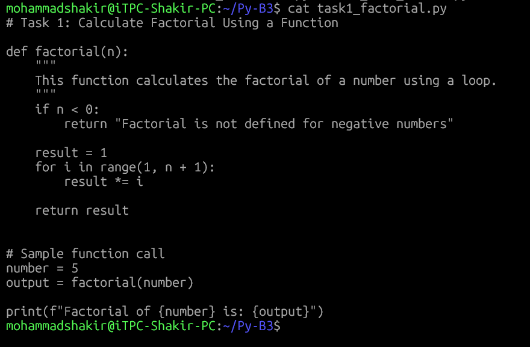
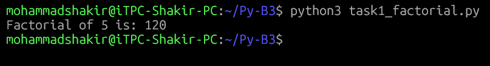
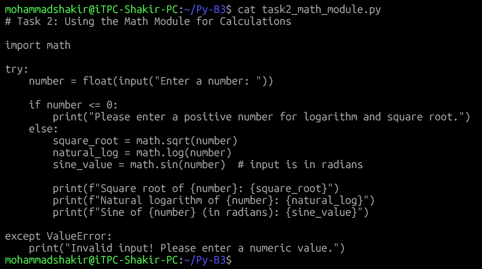
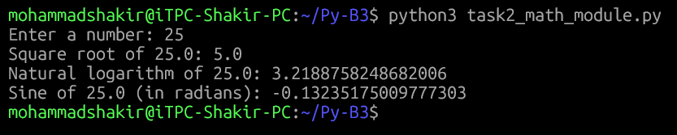

# Module 4: Functions & Modules in Python

###### This project demonstrates the use of Python functions and built-in modules by calculating the factorial of a number and performing mathematical operations using the math module. It showcases function creation, user input handling, and basic error validation as part of Python Module 4.

---

## 📌 Project Overview

This assignment demonstrates the use of **Python functions** and the **math module**.  
It includes:
- A function to calculate factorial of a number
- Mathematical calculations using Python’s built-in `math` module

---

## 📁 Project Structure
```md
Py-B3/
├── README.md
├── Screenshots
│   ├── 01-task1-code.png
│   ├── 02-task1-output.png
│   ├── 03-task2-code.png
│   ├── 04-task2-input.png
│   └── 05-task2-output.png
├── task1_factorial.py
└── task2_math_module.py
```

---

## 🧮 Task 1: Calculate Factorial Using a Function

### 🔹 Description
- Defines a function named `factorial`
- Uses a loop to calculate factorial
- Calls the function with a sample value and prints the result

### 📸 Screenshots

#### 1️⃣ Task 1 – Python Code


#### 2️⃣ Task 1 – Output


---

## 📐 Task 2: Using the Math Module for Calculations

### 🔹 Description
- Takes a number as user input
- Uses the `math` module to calculate:
  - Square root
  - Natural logarithm
  - Sine (in radians)
- Displays the calculated results

### 📸 Screenshots

#### 3️⃣ Task 2 – Python Code


#### 4️⃣ Task 2 – User Input


#### 5️⃣ Task 2 – Output


---

## ▶️ How to Run the Programs

1. Open a terminal or command prompt
2. Navigate to the project folder
3. Run the scripts using:

```bash
python task1_factorial.py
python task2_math_module.py
```
