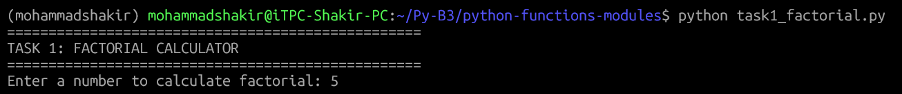
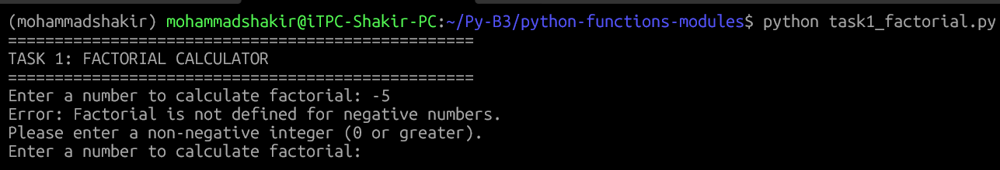
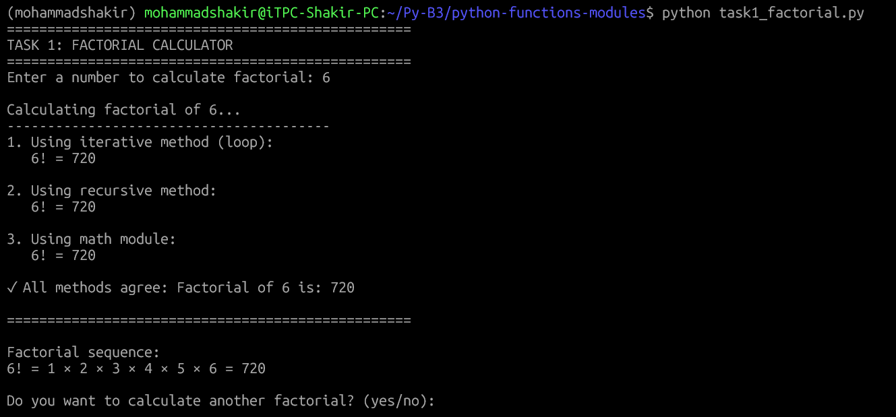
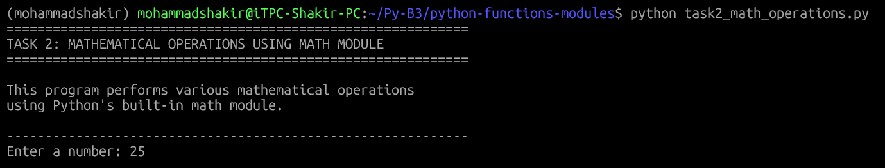
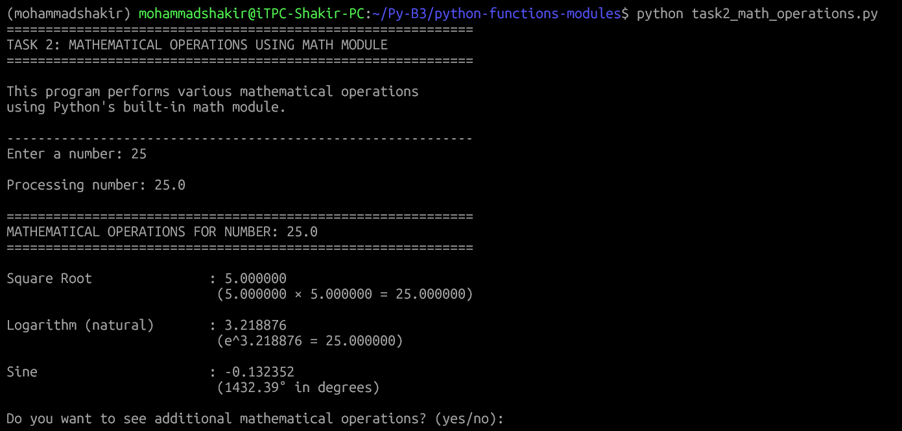
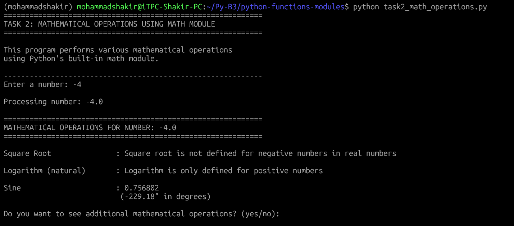
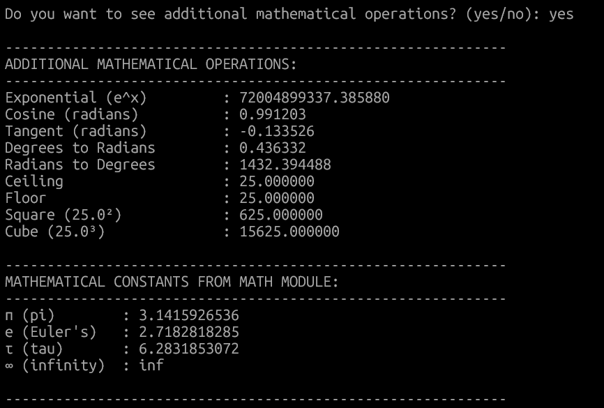
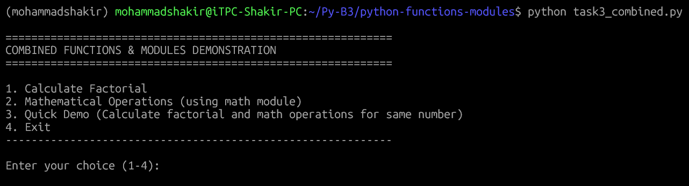
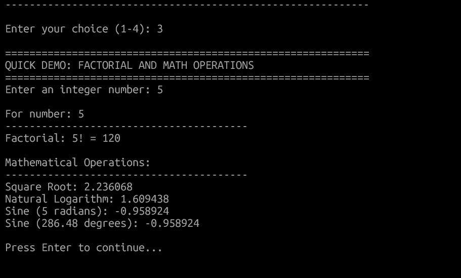

# Python Functions & Modules Assignment

A comprehensive demonstration of Python functions and modules with factorial calculation and mathematical operations using the math module.

## 📋 Table of Contents
- [Project Overview](#project-overview)
- [Tasks](#tasks)
  - [Task 1: Factorial Calculator](#task-1-factorial-calculator)
  - [Task 2: Math Module Operations](#task-2-math-module-operations)
- [Screenshots](#screenshots)
- [Installation & Setup](#installation--setup)
- [Usage](#usage)
- [Error Handling](#error-handling)
- [Learning Outcomes](#learning-outcomes)
- [Technologies Used](#technologies-used)
- [Author](#author)

---
```md
python-functions-modules/
│
├── task1_factorial.py          # Task 1: Factorial calculator
├── task2_math_operations.py    # Task 2: Math module operations
├── task3_combined.py           # Optional combined program
├── math_functions.py           # Optional custom math module
├── README.md                   # Project documentation
├── requirements.txt            # Dependencies (none required)
└── screenshots/                # Screenshots folder
    ├── task1_input.png
    ├── task1_factorial_5.png
    ├── task1_factorial_0.png
    ├── task1_error.png
    ├── task1_sequence.png
    ├── task2_input.png
    ├── task2_positive.png
    ├── task2_negative.png
    ├── task2_additional.png
    ├── task2_constants.png
    ├── task2_decimal.png
    ├── combined_menu.png
    └── combined_demo.png
```	
	

## Project Overview

This project contains two Python programs that demonstrate the use of **functions** and **modules** in Python:

1. **Factorial Calculator** - Calculates factorial using iterative, recursive, and math module approaches
2. **Math Operations** - Demonstrates various mathematical operations using Python's built-in `math` module

---

## Tasks

### Task 1: Factorial Calculator
**File:** `task1_factorial.py`

This program defines multiple functions to calculate factorial:
- **Iterative method** using loops
- **Recursive method** using function recursion
- **Math module method** using `math.factorial()`

**Features:**
- Input validation for non-negative integers
- Multiple implementation approaches
- Detailed step-by-step calculation display
- Interactive user interface with option to calculate multiple factorials

### Task 2: Math Module Operations
**File:** `task2_math_operations.py`

This program demonstrates various mathematical operations:
- Square root calculation
- Natural logarithm (log base e)
- Sine function (in radians)
- Additional operations (exponential, cosine, tangent, etc.)
- Display of mathematical constants (π, e, τ)

**Features:**
- Comprehensive error handling
- Support for both positive and negative numbers
- Formatted output with explanations
- Display of mathematical constants

---

## Screenshots

### Task 1: Factorial Calculator

#### Program Start - User Input

*User enters a number to calculate factorial*

#### Factorial Calculation - Small Number (5)

*Calculating factorial of 5 using all three methods*

#### Factorial Calculation - Zero

*Factorial of 0 is 1 (by definition)*

#### Error Handling - Negative Number

*Program gracefully handles negative numbers*

#### Factorial Sequence Display

*Display of factorial multiplication sequence for small numbers*

---

### Task 2: Math Module Operations

#### Program Start - User Input

*User enters a number for mathematical operations*

#### Calculations for Positive Number (25)

*Square root, logarithm, and sine calculations for 25*

#### Calculations for Negative Number (-4)

*Handling of negative numbers for square root and logarithm*

#### Additional Operations Display

*Display of additional mathematical operations when requested*

#### Mathematical Constants

*Display of mathematical constants from math module*

#### Calculation for Decimal Number (3.14)

*Operations performed on decimal numbers*

---

### Combined Program (Optional)

#### Main Menu

*Menu-driven interface for the combined program*

#### Quick Demo

*Demonstrating both factorial and math operations for the same number*

---

## Installation & Setup

### Prerequisites
- Python 3.6 or higher installed on your system
- Git (optional, for cloning repository)

### Installation Steps

1. **Clone the repository:**
```bash
git clone https://github.com/yourusername/python-functions-modules.git
cd python-functions-modules
```
Verify Python installation:

bash
python --version
No additional packages required - All programs use Python's standard library only.

## Usage
### Running Task 1: Factorial Calculator
```bash
python task1_factorial.py
```
### Running Task 2: Math Operations
```bash
python task2_math_operations.py
```

### Running Combined Program 
```bash
python task3_combined.py
```
## Error Handling

Both programs include comprehensive error handling:

### Task 1: Factorial Calculator

| Scenario             | Input | Expected Behavior                                      |
|---------------------|-------|-------------------------------------------------------|
| Negative number      | -5    | Error: Factorial not defined for negative numbers    |
| Non-numeric input    | abc   | Error: Invalid integer input                          |
| Empty input          | [Enter] | Error: No input provided                             |
| Large number (>1000) | 2000  | Graceful handling with recursion warning             |

### Task 2: Math Module Operations

| Scenario                        | Input   | Expected Behavior                                         |
|---------------------------------|---------|----------------------------------------------------------|
| Negative number for square root  | -4      | Error: Square root not defined for negative numbers      |
| Zero or negative for logarithm  | 0       | Error: Logarithm only defined for positive numbers      |
| Non-numeric input                | abc     | Error: Invalid number input                               |
| Large numbers                    | 1e308   | Handled gracefully within Python's limits                |

---

## Learning Outcomes

By completing these tasks, you will learn:

- Function definition and invocation  
- Recursive functions  
- Importing and using modules  
- Mathematical operations with the `math` module  
- Error handling and input validation  

---

## Technologies Used

- **Language:** Python 3.6+  
- **Modules:** `math` (built-in)  
- **Dependencies:** None required  

---

## Testing

### Task 1: Factorial Calculator

| Input | Expected Output | Status |
|-------|----------------|--------|
| 0     | 1              | ✓ Pass |
| 1     | 1              | ✓ Pass |
| 5     | 120            | ✓ Pass |
| 10    | 3,628,800      | ✓ Pass |
| -3    | Error message  | ✓ Pass |
| "abc" | Error message  | ✓ Pass |

### Task 2: Math Module Operations

| Input   | Square Root | Logarithm | Sine   |
|---------|------------|-----------|--------|
| 25      | 5.0        | 3.2189    | -0.1324 |
| 100     | 10.0       | 4.6052    | -0.5064 |
| -4      | Error      | Error     | 0.7568  |
| 0       | 0.0        | Error     | 0.0     |
| 3.14159 | 1.7725     | 1.1447    | 0.0     |

---

## Troubleshooting

| Issue | Solution |
|-------|---------|
| "Module not found" error | All programs use only built-in modules. Check Python installation with `python --version`. |
| Recursion depth exceeded | For large numbers (>1000), use iterative method. Program handles this gracefully. |
| Input validation not working | Ensure you're entering numeric values. The program will display error messages. |
| Square root of negative number | Program displays an error message explaining that square roots of negative numbers are not real numbers. |
| Permission denied when running Python | Ensure Python is added to PATH or use `python3` on Unix systems. |

---

## Author

**Mohammad Shakir**  

- Module: Functions & Modules in Python  
- Course Reference: Module 4 – Functions & Modules in Python from the Python programming course  
- Key Topics Covered:
  - Function definition and invocation  
  - Recursive functions  
  - Importing and using modules  
  - Mathematical operations with `math` module  
  - Error handling and input validation  

---

## License

This project is created for educational purposes as part of a Python programming assignment.

---

## Acknowledgments

- Python Software Foundation for the excellent Python programming language  
- Course instructors for providing clear guidelines and expectations  
- Math module documentation for detailed function explanations  
