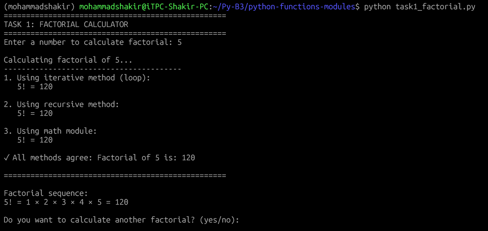
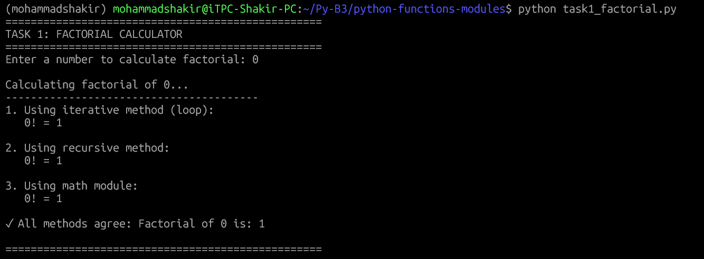
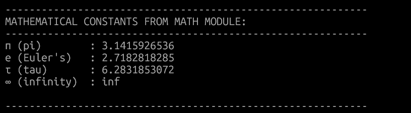
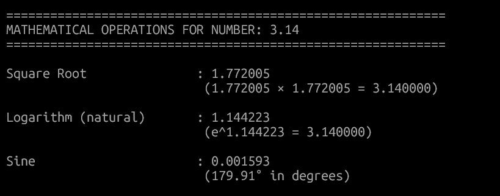

# Python Functions & Modules Assignment

A comprehensive demonstration of Python functions and modules with factorial calculation and mathematical operations using the math module.

## 📋 Table of Contents
- [Project Overview](#project-overview)
- [Tasks](#tasks)
  - [Task 1: Factorial Calculator](#task-1-factorial-calculator)
  - [Task 2: Math Module Operations](#task-2-math-module-operations)
- [Screenshots](#screenshots)
- [Installation & Setup](#installation--setup)
- [Usage](#usage)
- [Error Handling](#error-handling)
- [Learning Outcomes](#learning-outcomes)
- [Technologies Used](#technologies-used)
- [Author](#author)

---

## Project Overview

This project contains two Python programs that demonstrate the use of **functions** and **modules** in Python:

1. **Factorial Calculator** - Calculates factorial using iterative, recursive, and math module approaches
2. **Math Operations** - Demonstrates various mathematical operations using Python's built-in `math` module

---

## Tasks

### Task 1: Factorial Calculator
**File:** `task1_factorial.py`

This program defines multiple functions to calculate factorial:
- **Iterative method** using loops
- **Recursive method** using function recursion
- **Math module method** using `math.factorial()`

**Features:**
- Input validation for non-negative integers
- Multiple implementation approaches
- Detailed step-by-step calculation display
- Interactive user interface with option to calculate multiple factorials

### Task 2: Math Module Operations
**File:** `task2_math_operations.py`

This program demonstrates various mathematical operations:
- Square root calculation
- Natural logarithm (log base e)
- Sine function (in radians)
- Additional operations (exponential, cosine, tangent, etc.)
- Display of mathematical constants (π, e, τ)

**Features:**
- Comprehensive error handling
- Support for both positive and negative numbers
- Formatted output with explanations
- Display of mathematical constants

---

## Screenshots

### Task 1: Factorial Calculator

#### Program Start - User Input

*User enters a number to calculate factorial*

#### Factorial Calculation - Small Number (5)

*Calculating factorial of 5 using all three methods*

#### Factorial Calculation - Zero

*Factorial of 0 is 1 (by definition)*

#### Error Handling - Negative Number

*Program gracefully handles negative numbers*

#### Factorial Sequence Display

*Display of factorial multiplication sequence for small numbers*

---

### Task 2: Math Module Operations

#### Program Start - User Input

*User enters a number for mathematical operations*

#### Calculations for Positive Number (25)

*Square root, logarithm, and sine calculations for 25*

#### Calculations for Negative Number (-4)

*Handling of negative numbers for square root and logarithm*

#### Additional Operations Display

*Display of additional mathematical operations when requested*

#### Mathematical Constants

*Display of mathematical constants from math module*

#### Calculation for Decimal Number (3.14)

*Operations performed on decimal numbers*

---

### Combined Program (Optional)

#### Main Menu

*Menu-driven interface for the combined program*

#### Quick Demo

*Demonstrating both factorial and math operations for the same number*

---

## Installation & Setup

### Prerequisites
- Python 3.6 or higher installed on your system
- Git (optional, for cloning repository)

### Installation Steps

1. **Clone the repository:**
```bash
git clone https://github.com/yourusername/python-functions-modules.git
cd python-functions-modules
```
